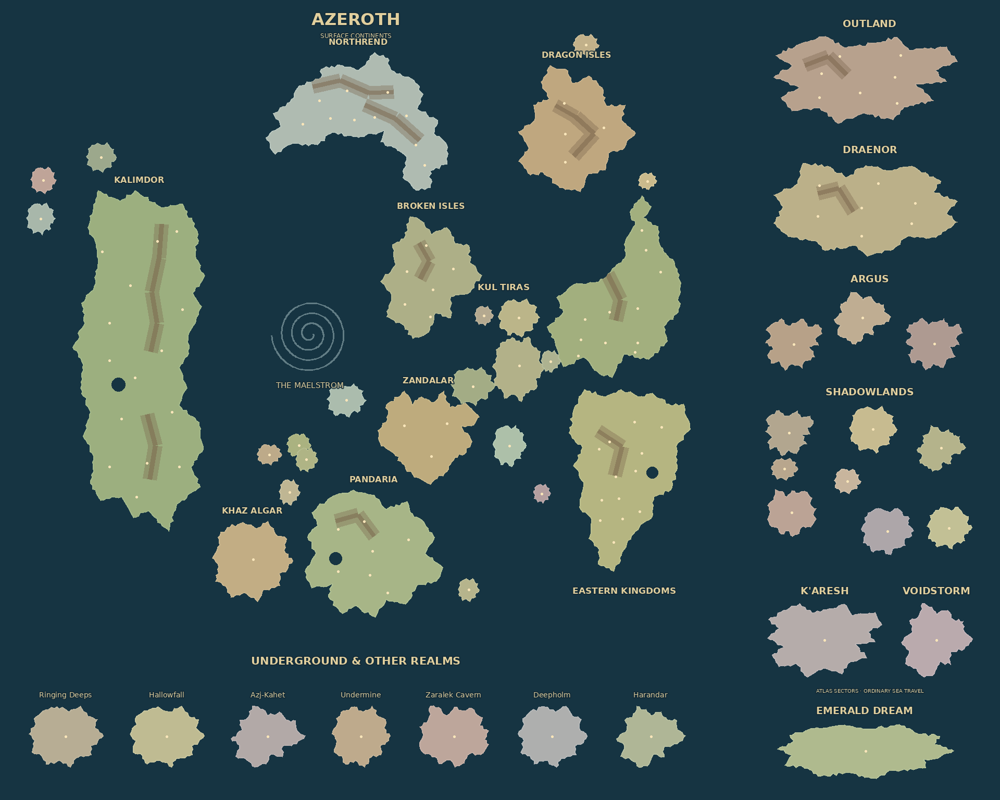

# Azeroth · All Expansions

Mappa custom selezionabile nelle categorie **New** e **Fictional**, per partite
private e singleplayer. La rotazione pubblica ha peso zero. Il tema Flower Power
rimane attivo per le unità anche su questa mappa.



## Copertura

La mappa rappresenta la geografia principale di Classic e di tutte le undici
espansioni pubblicate fino a **Midnight**, con le principali aggiunte delle patch.
Non contiene ogni dungeon, raid o sottozona, né pretende di essere una copia
esatta della cartografia di WoW.

| Capitolo               | Territori rappresentati                                                                      |
| ---------------------- | -------------------------------------------------------------------------------------------- |
| Classic                | Kalimdor e Regni Orientali, con città e regioni principali                                   |
| The Burning Crusade    | Terre Esterne, Quel'Thalas, Quel'Danas, Azuremyst e Bloodmyst                                |
| Wrath of the Lich King | Northrend, con dieci posizioni di partenza                                                   |
| Cataclysm              | Hyjal, Uldum, Gilneas, Twilight Highlands, Vashj'ir, Kezan, Lost Isles, Tol Barad e Deepholm |
| Mists of Pandaria      | Pandaria, Wandering Isle, Isle of Thunder e Timeless Isle                                    |
| Warlords of Draenor    | Draenor e le sue sette regioni                                                               |
| Legion                 | Broken Isles, Broken Shore e i tre settori di Argus                                          |
| Battle for Azeroth     | Kul Tiras, Zandalar, Mechagon e Nazjatar                                                     |
| Shadowlands            | Bastion, Maldraxxus, Ardenweald, Revendreth, The Maw, Oribos, Korthia e Zereth Mortis        |
| Dragonflight           | Dragon Isles, Forbidden Reach, Zaralek Cavern ed Emerald Dream                               |
| The War Within         | Isle of Dorn, Ringing Deeps, Hallowfall, Azj-Kahet, Undermine e K'aresh                      |
| Midnight               | Silvermoon/Eversong, Zul'Aman, Harandar e Voidstorm                                          |

**The Last Titan** è un'espansione futura: Northrend è presente, ma non sono state
inventate le sue nuove zone o interpretate come contenuti già pubblicati.

## Adattamento per OpenFront

- Il terreno misura **1920 × 1536**, con 123 posizioni nominate. Il formato
  Compact misura 960 × 768. Sono inclusi anche binari e miniatura a scala ridotta.
- Le coste sono sagome originali semplificate, con piccole insenature generate in
  modo ripetibile. I continenti di superficie conservano la disposizione generale:
  Kalimdor a ovest, Regni Orientali a est, Northrend a nord e Pandaria a sud.
- Terre Esterne, Draenor, Argus, Shadowlands, K'aresh e Voidstorm occupano settori
  sulla destra. Sotterranei e altri reami occupano settori inferiori. La loro
  posizione nell'atlante serve al gameplay e **non** indica che siano isole
  fisicamente adiacenti ad Azeroth.
- I settori comunicano tramite il normale mare navigabile. Non sono introdotti
  portali, caricamenti di nuove mappe o livelli sovrapposti. Le regole di barche,
  missili e conquista sono quelle standard.
- Vashj'ir e Nazjatar sono adattati a territori emersi conquistabili; il Maelstrom
  è un motivo sul mare, senza muri invisibili. I rilievi influenzano i costi del
  terreno. Non viene usato terreno invalicabile.
- Le proporzioni privilegiano spazio per spawn, costruzioni e battaglie. Isole e
  regni minori sono ingranditi per rimanere utilizzabili anche in Compact.
- I colori regionali e i nomi dei continenti sono due livelli grafici opzionali,
  disattivabili nelle impostazioni. Non influenzano lo stato della simulazione.
  I nomi delle nazioni provengono dalle località dell'atlante.

## Modifica e rigenerazione

La geometria editabile è in [`scripts/maps/create_azeroth.py`](../scripts/maps/create_azeroth.py):
`COASTS` contiene i contorni normalizzati, `REGIONS` posizione/dimensione di ogni
regione e spawn, `RIDGES` i rilievi. Non occorre una texture o un servizio esterno.

Serve Python 3 con Pillow ≥ 10.1 per rigenerare le sorgenti, e Go ≥ 1.24.4 per la pipeline
ufficiale. Le build Docker/Render usano direttamente gli asset già inclusi:

```sh
python scripts/maps/create_azeroth.py
cd map-generator
go run . --maps=azeroth
```

Sorgenti: `map-generator/assets/maps/azeroth/`.
Asset runtime: `resources/maps/azeroth/`.
Il generatore registra automaticamente l'enum e il selettore in
`src/core/game/Maps.gen.ts`, oltre alla voce inglese in `resources/lang/en.json`.

## Verifica

`tests/AzerothMap.test.ts` usa i binari reali: caricamento Normal/Compact,
validità delle posizioni nominate, conteggio del terreno, Maelstrom navigabile,
assenza di muri invalicabili e avvio/avanzamento della simulazione con giocatori
su continenti e reami differenti. I test generali controllano registro, manifest,
flag e livelli. In tutte e tre le scale, le 45 masse di terra hanno accesso allo
stesso oceano connesso. La rigenerazione delle sorgenti e dei binari produce gli
stessi byte; gli asset della build con hash corrispondono ai file runtime.
La verifica completa di una partita nel browser resta da fare.

## Riferimenti geografici

Consultati il 9 ottobre 2026. La fonte cartografica è stata usata come riferimento
visivo della disposizione generale; nessun pixel del suo artwork è distribuito.

- [Atlante di Azeroth con Khaz Algar](https://media.mmo-champion.com/images/news/2024/july/947azerothunexplored.png)
- [Blizzard: zone di Midnight](https://worldofwarcraft.blizzard.com/news/24223893/explore-the-zones-of-midnight)
- [Blizzard: Khaz Algar](https://worldofwarcraft.blizzard.com/it-it/news/24125258/esplora-le-zone-e-le-spedizioni-di-the-war-within)
- [Blizzard: Ghosts of K'aresh](https://worldofwarcraft.blizzard.com/en-us/news/24226730/the-war-within-ghosts-of-karesh-goes-live-august-5)
- [Blizzard: Undermine](https://worldofwarcraft.blizzard.com/en-us/news/24174172/)
- [Blizzard: Guardians of the Dream](https://worldofwarcraft.blizzard.com/en-us/news/24020034)
- [Blizzard: Shadowlands](https://worldofwarcraft.blizzard.com/en-us/news/23187291/world-of-warcraft-what-s-next-panel-recap)
- [Blizzard: Cataclysm](https://worldofwarcraft.blizzard.com/en-us/news/24095666)

È un atlante fan non ufficiale. Nomi e geografia di Warcraft appartengono a
Blizzard Entertainment. Contorni, terreno, livelli e codice di generazione sono
stati creati per questo fork; non sono incluse texture, loghi o mappe ufficiali.
