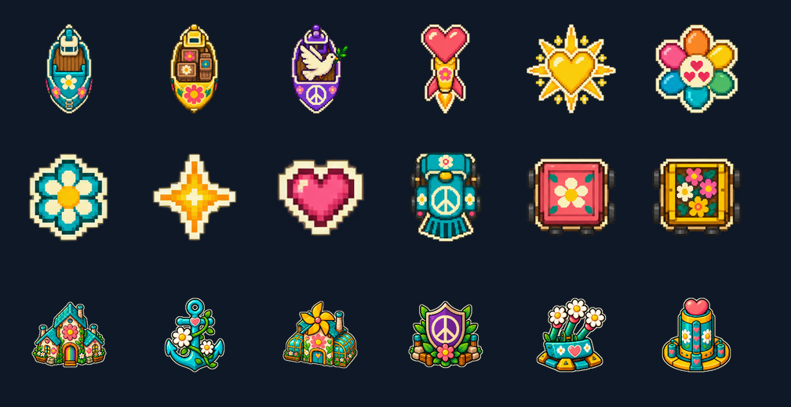

# Flower Power

Il fork usa un tema grafico unico ispirato ai figli dei fiori. È già collegato
alla mappa, alle anteprime, al menu costruzioni, ai contatori e alla barra God:
non richiede account, cataloghi remoti o acquisti.



## Sprite e atlas

Le immagini sorgenti sono PNG RGBA da 128 × 128 pixel, con sfondo trasparente.
Gli atlas mantengono l'ordine delle colonne atteso dal renderer. La risoluzione
della texture aumenta il dettaglio nello zoom; dimensioni sulla mappa, velocità,
danni, costi, tempi di costruzione e regole restano quelli della simulazione.

| Colonna unità | Sorgente in `resources/sprites/` | Aspetto                                      | Ingombro massimo in tile |
| ------------- | -------------------------------- | -------------------------------------------- | ------------------------ |
| 0             | `transportship.png`              | Barca con margherite                         | 5                        |
| 1             | `tradeship.png`                  | Barca mercantile floreale                    | 5                        |
| 2             | `warship.png`                    | Barca viola con colomba e simbolo della pace | 11                       |
| 3             | `atombomb.png`                   | Missile con cuore rosa                       | 7                        |
| 4             | `hydrogenbomb.png`               | Cuore solare dorato                          | 9                        |
| 5             | `mirv2.png`                      | Fiore arcobaleno con semi a cuore            | 13                       |
| 6             | `samMissile.png`                 | Margherita turchese                          | 3                        |
| 7             | `shell.png`                      | Stellina di coriandoli                       | 1                        |
| 8             | `mirvWarhead.png`                | Seme a cuore                                 | 3                        |
| 9             | `trainEngine.png`                | Locomotiva con simbolo della pace            | 5                        |
| 10            | `trainCarriage.png`              | Vagone dipinto con un fiore                  | 5                        |
| 11            | `trainCarriageLoaded.png`        | Vagone carico di fiori                       | 5                        |

`resources/atlases/unit-atlas.png` contiene queste 12 colonne, ciascuna da
128 × 128 pixel: dimensione complessiva 1536 × 128. Il quad di gioco resta da
13 tile; i singoli sprite sono centrati e scalati in base all'ingombro in tabella.
`mirv.png` conserva la stessa grafica di `mirv2.png` per i riferimenti precedenti.

| Colonna edifici | Sorgente in `resources/images/flower-power/` | Aspetto                                 |
| --------------- | -------------------------------------------- | --------------------------------------- |
| 0               | `city.png`                                   | Casette con fiori e ingresso arcobaleno |
| 1               | `port.png`                                   | Ancora con margherite e cuore           |
| 2               | `factory.png`                                | Serra comunitaria con girandola         |
| 3               | `defensePost.png`                            | Scudo viola con simbolo della pace      |
| 4               | `samLauncher.png`                            | Fioriera lanciamargherite               |
| 5               | `missileSilo.png`                            | Torre con cuori e margherite            |

`resources/atlases/icon-atlas.png` contiene le sei colonne da 128 × 128 pixel:
dimensione complessiva 768 × 128. Il manifest in
`resources/images/flower-power/manifest.json` registra ordine, sorgenti e scale.
Gli atlas sono già confezionati: la build Docker/Render non richiede strumenti
di generazione immagini.

## Colori e leggibilità

Il renderer conserva i colori saturi degli sprite. Le parti neutre delle unità
continuano a usare la palette del proprietario; gli edifici conservano i loro
contorni e forme colorati per giocatore. La vista alleanze applica ancora i
colori di affiliazione. Restano visibili costruzione, attacco, ritirata,
lampeggio dei missili e trasparenza delle testate fuori portata dei SAM.

L'aggiornamento sostituisce la grafica comune del fork, anche per i replay
visualizzati con questa versione. La selezione delle skin per giocatore è un
sistema separato dal tema.

## Generazione

Artwork generato con la skill ImageGen e lo strumento integrato di generazione
immagini. Le immagini selezionate sono state suddivise in sprite, ridimensionate
e confezionate negli atlas con Sharp. I PNG sorgenti sopra elencati sono gli
asset finali del progetto; non dipendono da file temporanei.

Prompt unità:

```text
Use case: stylized-concept. Asset type: production game sprite atlas for a 2D top-down territorial strategy game. Create ONE transparent PNG sprite sheet with EXACTLY 12 isolated sprites arranged in a strict evenly spaced 4-column by 3-row grid. No labels, no lettering, no grid lines, no background, no shadows outside sprites, no watermark. Each sprite centered in its cell with generous transparent padding (object occupies at most 65 percent of cell), no overlap. Style: bold readable 1960s flower-power / hippie sticker pixel-inspired art, simple flat chunky forms, jewel colors coral pink, sunflower yellow, turquoise, violet, cream outlines. Use clear geometry and very few details so silhouettes remain readable at 13 pixels. All mostly circular or square top-down icons, not side-view vehicles. Order left to right, top to bottom: Row 1: (1) turquoise flower-decorated transport boat icon, (2) golden flower cargo boat icon, (3) violet peace dove on a small boat replacing warship, (4) bright coral heart-shaped atomic missile icon. Row 2: (5) large golden radiant heart sun replacing hydrogen bomb, (6) six-petaled rainbow flower with three small heart seeds in center replacing MIRV, (7) tiny turquoise daisy with white petals replacing SAM missile, (8) tiny sparkling yellow four-point confetti star replacing cannon shell. Row 3: (9) tiny pink heart seed replacing MIRV warhead, (10) turquoise peace-symbol hippie train engine seen from above, (11) coral flower-painted square train carriage from above, (12) golden square train carriage filled with flowers from above. These are individual usable game sprites, not an illustration or poster. Maintain consistent cream outlines and true alpha transparency.
```

Prompt edifici:

```text
Use case: stylized-concept. Asset type: ONE transparent production sprite sheet containing six BUILDING ICONS for a 2D top-down strategy game. Exactly 3 columns and 2 rows of isolated sprites, each centered in its cell, wide completely transparent gutters. Each sprite fits inside a square, at most 60 percent of its cell; preserve generous blank margins, no overlap and no clipping. Style: clean cheerful 1960s flower-power hippie pixel-art stickers with chunky readable silhouettes, limited detail, cream outline, saturated turquoise, coral pink, sunflower yellow, violet and leaf green. Match the mood of flower-painted hippie boats, heart missiles and rainbow flowers. Not photorealistic, no ground scenery, no text, no labels, no watermark. Strict order left to right top to bottom: Row 1: CITY = cluster of three cheerful tiny flower-painted cottages, turquoise roofs, a large pink daisy and rainbow doorway; PORT = turquoise anchor wrapped in two white daisies and a small pink heart; FACTORY = friendly community greenhouse workshop with golden pinwheel roof and large daisy painted on front, one short chimney (no smoke). Row 2: DEFENSE POST = violet shield with a bold cream peace symbol, leaves and one pink flower; SAM LAUNCHER = three white daisies on green stalks mounted on a turquoise flower planter shaped like a defensive launch stand, facing slightly upward; MISSILE SILO = turquoise cylindrical love tower with a coral heart on top, yellow circular base and two white daisies. All six should have distinct instantly identifiable silhouettes, be decorative but usable as tiny 64px gameplay icons. True transparent alpha background, no drop shadows, no outlines around the grid.
```

Passaggio finale per la trasparenza degli edifici:

```text
Use case: background-extraction. Edit target: the supplied six-building sprite sheet. Remove ONLY the cloudy colored background / haze / gradient and all external drop shadows. Make EVERY pixel outside the six isolated building sprites fully transparent, alpha zero, including all gutters between the sprites and all corners. Keep the six buildings themselves pixel-identical in design, palette, arrangement, size, position, cream outlines and details: cottages, anchor, greenhouse, peace shield, daisy launcher, heart silo. Keep the same 3-column by 2-row layout and canvas proportions. This must be a usable game sprite sheet with real clean alpha, not a picture of sprites on a background. No checkerboard baked into image, no new objects, no text. Preserve opaque cream border pixels; no semitransparent haze behind or between icons.
```

## Verifica

I due shader reali sono stati compilati e collegati con OpenGL ES 3.2 su Mesa
llvmpipe tramite EGL, poi usati per renderizzare tutti i 18 slot. La prova
confronta grafica a colori, palette neutra originale, vista alleanze, stato di
costruzione, segnale di attacco, lampeggio e trasparenza fuori portata.
La prova non sostituisce la verifica della partita completa in un browser su
Render.
